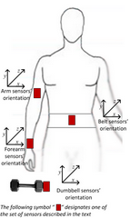

#Human Activity Recognition

Human Activity Recognition **HAR** has emerged as a key research area in the last years and is gaining increasing attention by the pervasive computing research community. Using devices such as Jawbone Up, Nike FuelBand, and Fitbit it is now possible to collect a large amount of data about personal activity relatively inexpensively.  

